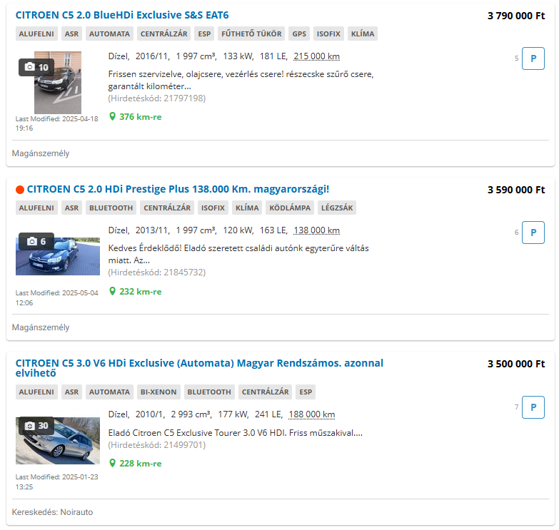

# hahu-feltoltes-datum
Megjeleníti a hasznaltauto.hu találati listáján a hirdetés feltöltés idejét

## Kell hozzá:
- böngésző
- Python 3

## Telepítés (Windows)
[Python telepítése](https://tutorial.djangogirls.org/hu/python_installation/)

CMD
```
pip install flask requests flask-cors
```

## Futtatás:
Konzolban
```
python proxy.py
```
elidítása

## Böngészőben
Egy új könyvjelzőbe bemásolni a bookmarklet fájlban található kódot
[Chrome](https://tutorial.djangogirls.org/hu/python_installation/](https://support.google.com/chrome/answer/188842?hl=hu&co=GENIE.Platform%3DDesktop
)
[Firefox](https://support.mozilla.org/hu/kb/hogyan-hasznaljuk-a-konyvjelzoket)

## Eredmény

